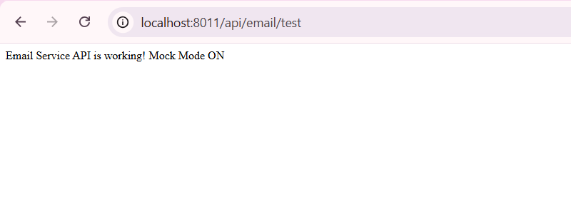
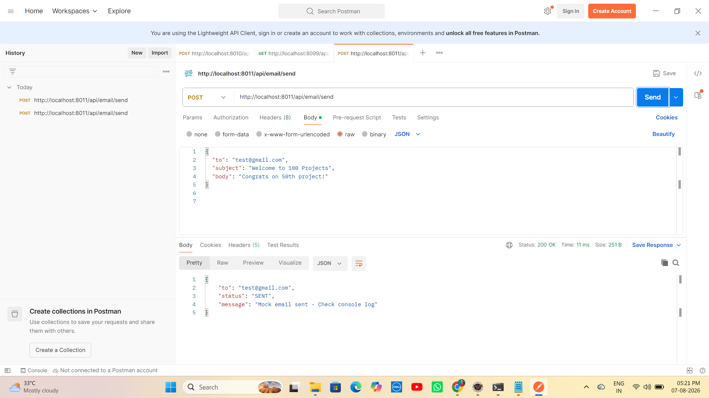

# 📧 Project 50 – Email Service API (Mock + SMTP)


---

# 📖 Project Overview

**Email Service API** is Project **50** of **Tier 5 – Spring Boot + REST + Security**, developed using **Java 21**, **Spring Boot 4.1.0**, **Spring Web** and **Mock Mode Architecture**.

A production-ready email backend with **Dual Mode**: Mock Mode (for testing without SMTP credentials) and Real SMTP Mode (Gmail SMTP ready). This project demonstrates a real-world email service flow similar to applications like Amazon, Flipkart, and LinkedIn for OTP, Welcome Email, Order Confirmation and Notifications.

Users can send simple text emails and HTML emails via REST API. In Mock Mode, emails are logged to console - perfect for development without needing real credentials. This is the **50th Project - Half Century Milestone!**

---

# ✨ Features

- Send Simple Text Email via REST API (`/api/email/send`)
- Send HTML Email API (`/api/email/send-html`)
- Dual Mode: Mock Mode (ON) + Real SMTP Mode (OFF) via `app.email.mock`
- Mock Mode Console Logging (No Real SMTP Needed - Perfect for Dev)
- Jakarta Validation (@NotBlank) for Email Request
- Real Gmail SMTP Ready (Just add App Password in properties)
- Health Check API `/api/email/test` -> "Email Service API is working! Mock Mode ON"
- Proper Request/Response DTO Structure
- Embedded Apache Tomcat 11

---

# 🛠 Technologies Used

- Java 21
- Spring Boot 4.1.0
- Spring Web (REST)
- Spring Mail (JavaMailSender - Ready for Real Mode)
- Jakarta Validation
- Maven 3.9+
- Postman
- cURL
- Apache Tomcat 11.0.22 (Embedded)
- STS / Eclipse IDE

---

# 📂 Project Structure

```text
50-email-service-api
│
├── src
│   └── main
│       ├── java
│       │   └── com
│       │       └── raviteja
│       │           └── email
│       │               ├── Application.java
│       │               ├── controller
│       │               │   └── EmailController.java
│       │               ├── service
│       │               │   └── EmailService.java
│       │               └── payload
│       │                   ├── EmailRequest.java
│       │                   └── EmailResponse.java
│       │
│       └── resources
│           └── application.properties
│
├── screenshots
│   ├── demo1.png
│   └── demo2.png
│
├── .gitignore
├── pom.xml
└── README.md
```

---

# ▶ How to Run

## 1⃣ Clone the Repository

```bash
git clone https://github.com/raviteja-dev950/50-email-service-api.git
```

---

## 2⃣ Import the Project

- Open **STS / Eclipse IDE**
- Import the project as **Existing Maven Project**
- Wait for dependencies to download

---

## 3⃣ Configure the Project

Spring Boot comes with **Embedded Apache Tomcat 11**, so no external Tomcat server configuration is required.

Verify the following configuration in **application.properties**

```properties
spring.application.name=50-email-service-api

server.port=8011

# Mock Mode - true = No real email, just console log
app.email.mock=true

# Real SMTP Config (Needed only when mock=false)
spring.mail.host=smtp.gmail.com
spring.mail.port=587
spring.mail.username=your_email@gmail.com
spring.mail.password=your_app_password
spring.mail.properties.mail.smtp.auth=true
spring.mail.properties.mail.smtp.starttls.enable=true
```

---

## 4⃣ Run the Project

- Right-click the project
- Select **Run As → Spring Boot App**
- Wait until the console displays:

```text
Tomcat started on port 8011 (http) with context path '/'
Started Application in X seconds
```

Open Browser and visit

```text
http://localhost:8011/api/email/test
```

You should see:

```text
Email Service API is working! Mock Mode ON
```

---

### Application Flow

```text
               Client
(Postman / Browser / cURL)
          │
          ▼
POST /api/email/send
{to, subject, body}
          │
          ▼
EmailController.send()
          │
          ▼
EmailService.sendSimple()
          │
          ▼
Check app.email.mock?
          │
    ┌─────┴──────┐
    ▼            ▼
mock=true    mock=false
    │            │
    ▼            ▼
Console Log  JavaMailSender
=== MOCK     Sends Real Email
EMAIL ===    via Gmail SMTP
    │            │
    └─────┬──────┘
          ▼
Return EmailResponse
to, status=SENT, message
          │
          ▼
Client Receives 200 OK
Mock email sent - Check console log
```

---

# 📸 Screenshots

## Test API - Browser



## Send Email API - Postman 200 OK



---

# 🧪 API Testing Examples

```bash
# HEALTH CHECK
curl http://localhost:8011/api/email/test

# SEND SIMPLE EMAIL
curl -X POST http://localhost:8011/api/email/send \
-H "Content-Type: application/json" \
-d "{\"to\":\"test@gmail.com\",\"subject\":\"Welcome to 100 Projects\",\"body\":\"Congrats on 50th project!\"}"

# SEND HTML EMAIL
curl -X POST http://localhost:8011/api/email/send-html \
-H "Content-Type: application/json" \
-d "{\"to\":\"test@gmail.com\",\"subject\":\"HTML Test\",\"body\":\"<h1>Hello</h1><p>50 Projects Done!</p>\"}"
```

Example Success Response (200 OK)

```json
{
  "to": "test@gmail.com",
  "status": "SENT",
  "message": "Mock email sent - Check console log"
}
```

Console Log Output (When mock=true):

```text
=== MOCK EMAIL ===
TO: test@gmail.com
SUB: Welcome to 100 Projects
BODY: Congrats on 50th project!
```

---

# 🎯 Learning Outcomes

- Understanding Email Sending Flow in Spring Boot
- Implementing Mock Mode Architecture (Industry Best Practice)
- Using JavaMailSender for Real SMTP Integration
- Building Dual-Mode Service (Mock for Dev, Real for Prod)
- Validating Email Requests using Jakarta Validation
- Creating Reusable Email Microservice for Projects 63-72 (Full Stack)
- Preparing Foundation for OTP, Welcome Email, Order Confirmation
- Achieving 50/100 Projects - Half Century Milestone!

---

# 🚀 Future Enhancements

- 📧 Enable Real SMTP with Gmail App Password
- 📄 HTML Templates with Thymeleaf for Beautiful Emails
- 🔑 OTP Email Service with Redis Expiry
- 📎 Attachment Support (Resume, Invoice PDF)
- 🗄️ Store Email Logs in MySQL with JPA
- 👥 Bulk Email API
- 📄 Swagger / OpenAPI 3 Documentation
- 🔐 JWT Security for Email Endpoints
- 🧪 JUnit 5 & Mockito Testing
- 📊 Email Dashboard & Logs
- ☁ Deploy to Render / Railway
- 🔄 Async Email with @Async and Queue

---

# 👨💻 Author

**Ravi Teja**

**Java Full Stack Developer**

**100 Java Full Stack Projects Challenge**

**Project 50 / 100 - HALF CENTURY COMPLETED! 🏆**


---

## ⭐ Support

If you found this project helpful, consider giving it a **⭐ Star** on GitHub.


